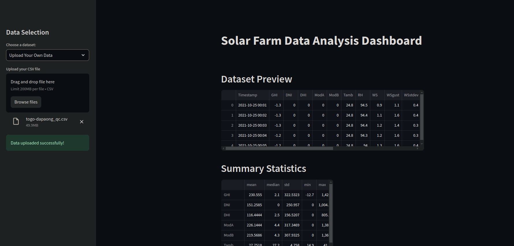
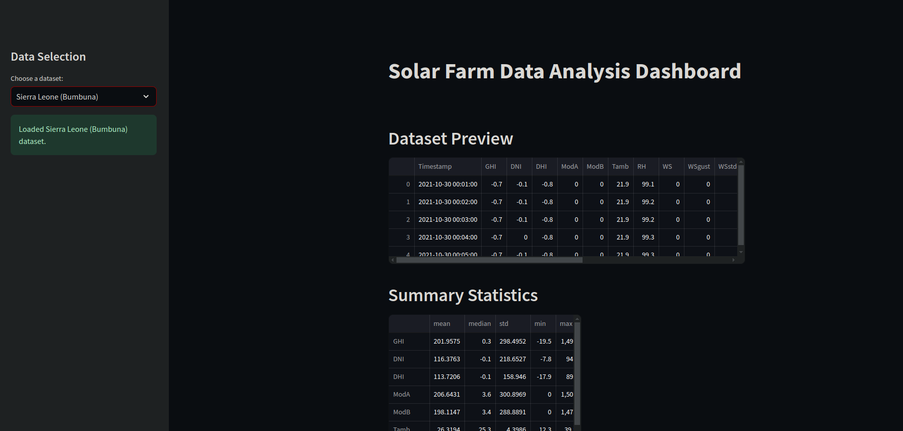
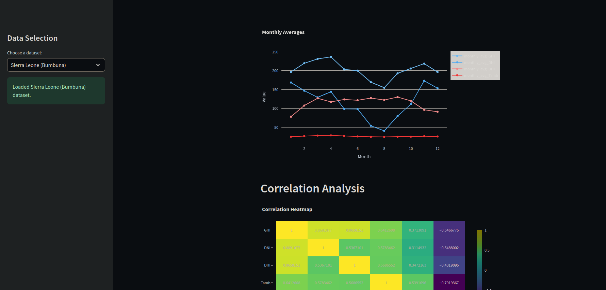

# 🌞 Solar Radiation Analysis  

A comprehensive project analyzing solar radiation data from **Benin**, **Sierra Leone**, and **Togo**. This analysis identifies high-potential regions for solar installations, offering insights through exploratory data analysis (EDA), statistical summaries, and interactive visualizations.  

---

## ☀️ Solar Radiation Analysis Dashboard 🌍  

An interactive, Streamlit-powered dashboard for analyzing solar radiation and related environmental factors. The app allows exploration of preloaded datasets or uploading custom CSV files for analysis.  

---

### 🌟 Preview  

#### 📺 Video Overview  
Watch a walkthrough of the dashboard in action:  

 <!-- Replace with the actual video file path -->  

#### 📸 Screenshots  

     
 
     
 
     
   
       

---

## 🚀 Features  

- **📊 Data Visualization**: Interactive plots for solar radiation trends and patterns.  
- **📈 Time Series Analysis**: Monthly averages and long-term trend analysis.  
- **📉 Correlation Analysis**: Heatmaps showing variable relationships.  
- **🌬️ Wind Analysis**: Visualize wind speed and directional distributions.  
- **📂 Upload Custom Data**: Analyze custom CSV files dynamically.  
- **💻 User-Friendly Interface**: Streamlined design with responsive visuals.  

---

## 📂 Project Structure  

```plaintext  
Solar-Radiation-Analysis/  
├── src/  
│   ├── data_processing.py       # Core data processing functions  
│   └── visualizations.py        # Functions for generating visualizations  
├── data/  
│   ├── benin-malanville.csv     # Sample dataset for Benin  
│   ├── sierraleone-bumbuna.csv  # Sample dataset for Sierra Leone  
│   └── togo-dapaong_qc.csv      # Sample dataset for Togo  
├── app/  
│   └── main.py                  # Streamlit application entry point  
├── assets/  
│   └── dashboard-preview.png    # Screenshots and visuals  
├── resources/  
│   ├── dashboard-demo.mp4       # Demo video of the dashboard  
│   ├── dashboard-interface.png  # Main dashboard screenshot  
│   ├── correlation-heatmap.png  # Heatmap visualization screenshot  
│   └── wind-analysis.png        # Wind analysis visualization screenshot  
├── README.md                    # Project documentation  
└── requirements.txt             # Dependencies  
```  

---

## 🛠️ Installation & Setup  

### Prerequisites  

- Python 3.8 or higher  
- Libraries: Streamlit, Pandas, Plotly, and others (listed in `requirements.txt`)  

### Steps  

1. **Clone the repository**:  
   ```bash  
   git clone https://github.com/jonnahjr/Solar-Radiation-Analysis.git  
   cd Solar-Radiation-Analysis  
   ```  

2. **Set up a virtual environment**:  
   ```bash  
   python3 -m venv env  
   source env/bin/activate  # On Windows: .\env\Scripts\activate  
   ```  

3. **Install dependencies**:  
   ```bash  
   pip install -r requirements.txt  
   ```  

4. **Run the Streamlit app**:  
   ```bash  
   streamlit run app/main.py  
   ```  

---

## 📊 Usage  

1. **Select a Dataset**: Choose from the sidebar or upload your custom CSV file.  
2. **Explore the Dashboard**:  
   - **Data Preview**: View dataset samples.  
   - **Statistical Insights**: Summary statistics of the dataset.  
   - **Time Series Trends**: Visualize temporal trends in solar radiation.  
   - **Correlation Analysis**: Heatmap of inter-variable relationships.  
   - **Wind Analysis**: Insights on wind speed and directional patterns.  
3. **Export Insights**: Use the visualizations for reporting and analysis.  

---

## 📁 Datasets  

| **Dataset Name**        | **Description**                                  |  
|--------------------------|-------------------------------------------------|  
| Benin (Malanville)       | Solar radiation data for Malanville, Benin.     |  
| Sierra Leone (Bumbuna)   | Solar radiation data for Bumbuna, Sierra Leone. |  
| Togo (Dapaong)           | Solar radiation data for Dapaong, Togo.         |  

---

## 🌟 Highlights  

- **Real-time Analysis**: Process and visualize data instantly.  
- **Interactive Visualizations**: Drill down into patterns with interactive graphs.  
- **Extensibility**: Modular code structure supports future improvements.  

---

## 🤝 Contributing  

We welcome contributions!  

1. Fork the repository.  
2. Create a feature branch:  
   ```bash  
   git checkout -b feature/your-feature  
   ```  
3. Commit your changes:  
   ```bash  
   git commit -m "Add feature description"  
   ```  
4. Push to your branch:  
   ```bash  
   git push origin feature/your-feature  
   ```  
5. Submit a pull request!  

---

## 📝 License  

This project is licensed under the [MIT License](./LICENSE).  

---

## 💬 Contact  

- **Name**: Yonas  
- **Location**: Addis Ababa, Ethiopia  
- **GitHub**: [jonnahjr](https://github.com/jonnahjr)  
- **Email**: [jonasjjonas14@gmail.com](mailto:jonasjjonas14@gmail.com)  

---

**⭐ If you find this project useful, please consider giving it a star!**

---

### Notes:  

1. Ensure the resources (video and images) are placed in the `resources/` folder and replace the placeholders in the README with their correct paths.  
2. Let me know if you need further refinements or additions.
